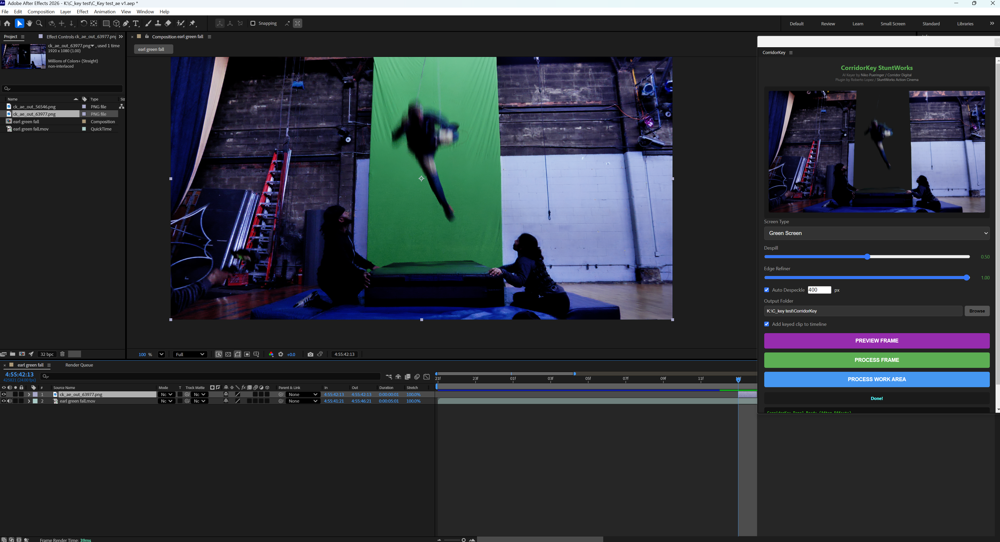
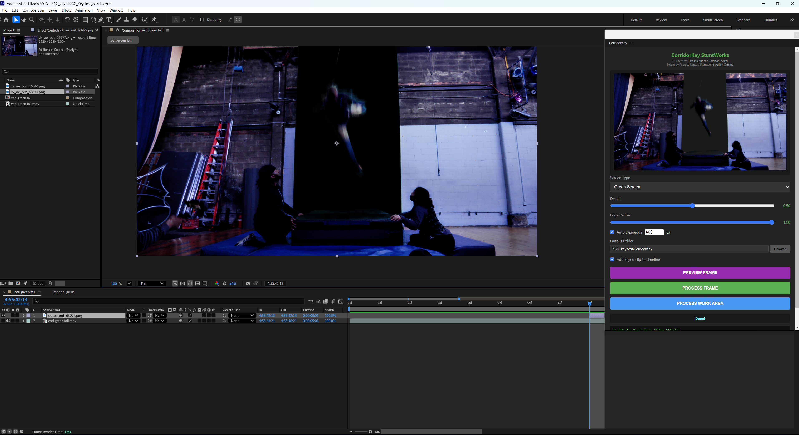
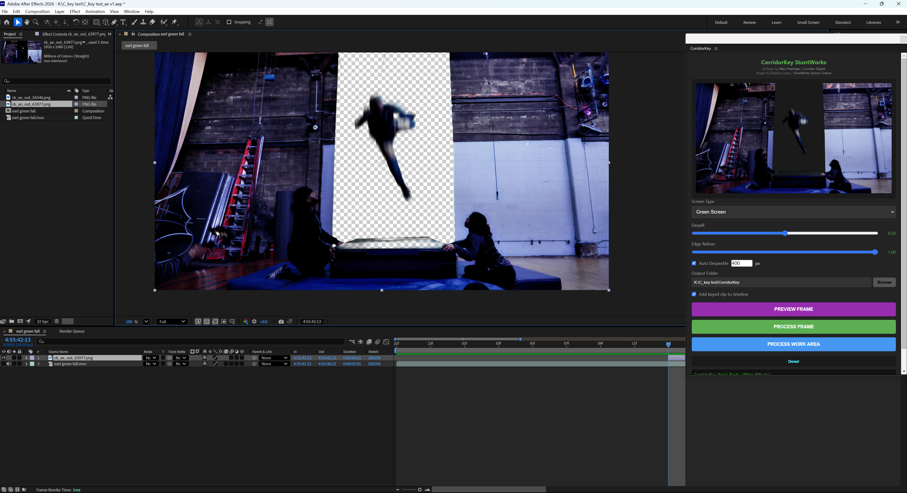
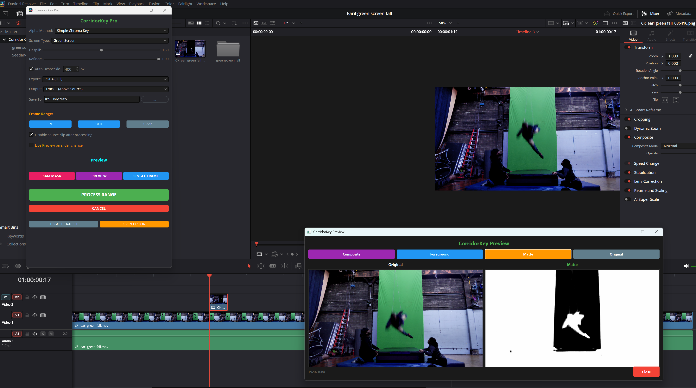

<div align="center">

# CorridorKey StuntWorks

### AI Green Screen Removal for Your Editor

[](https://www.blackmagicdesign.com/products/davinciresolve)
[](https://www.adobe.com/products/aftereffects.html)
[](https://www.adobe.com/products/premiere.html)

[](https://ko-fi.com/stuntworks)

[](LICENSE)
[](https://www.youtube.com/@stuntworkscinema)

---

**One-click neural keying powered by [CorridorKey](https://github.com/nikopueringer/CorridorKey)**
**by Niko Pueringer / Corridor Digital**

*Plugin by Roberto Lopez / [StuntWorks](https://www.youtube.com/@stuntworkscinema)*

</div>

---

## Why This Project Exists

StuntWorks Cinema is **Roberto Lopez and Elvis Lopez** — stunt performers and indie action filmmakers. We work primarily in **DaVinci Resolve** and **After Effects**, shooting real stunt and action shorts on tight budgets — imperfect green screen, bad lighting, motion blur, fast action — and existing keyers struggle with that footage. So we built this around Niko Pueringer's CorridorKey AI engine for our own films. Free for other action filmmakers. **Still building it.**

Watch what we make with it: **[youtube.com/@stuntworkscinema](https://www.youtube.com/@stuntworkscinema)**

---

> **Which version should I download?**
> For a verified, tested build use the latest **[release tag](https://github.com/stuntworks/CorridorKey-StuntWorks/releases)** (currently `v0.7.0`). The `main` branch is active development and may include unfinished work.

---

## Test Footage

Real stunt/action greenscreen clips for testing are attached to the [v0.7.0 release](https://github.com/stuntworks/CorridorKey-StuntWorks/releases/tag/v0.7.0).

> **Important:** These are intentionally difficult shots — fast action, motion blur, and suboptimal lighting — chosen to stress-test the plugin on worst-case material. Results on well-lit production greenscreen will be significantly cleaner.

---

## Before / After

| Before | Keyed | Composite |
|:---:|:---:|:---:|
|  |  |  |

---

## Screenshots

| DaVinci Resolve | Premiere Pro |
|:---:|:---:|
|  |  |

---

## What It Does

> Drop green screen footage in your editor. Click one button. Get a clean key.

- **SAM2 Garbage Matte** — click foreground / background points like Adobe's Roto Brush or DaVinci's Magic Mask. AI draws a precision matte applied to the render. Free, open source, works in all three editors.
- AI-powered green / blue screen removal — no manual color picking
- Works inside **Resolve**, **After Effects**, and **Premiere Pro**
- Live preview viewer — see your key in a floating window, drag sliders to update in real time
- Batch process entire clips or frame ranges
- Adjustable despill, edge refinement, and despeckle
- Output saves to your project folder automatically

---

## Requirements

| Requirement | Details |
|---|---|
| **CorridorKey Engine** | [Install from GitHub](https://github.com/nikopueringer/CorridorKey) with Python venv |
| **GPU** | NVIDIA with CUDA, 8GB+ VRAM recommended |
| **Editor** | Resolve Studio 18+, After Effects 2020+, or Premiere Pro 2020+ |

---

## Install

```bash
git clone https://github.com/stuntworks/CorridorKey-StuntWorks.git
cd CorridorKey-StuntWorks
python install.py
```

| Flag | What it does |
|---|---|
| `--all` | Install to all detected apps |
| `--resolve` | Resolve only |
| `--adobe` | AE + Premiere only |
| `--uninstall` | Remove from all apps |

> Set `CORRIDORKEY_ROOT` environment variable if your CorridorKey install isn't in a sibling directory.

> ⭐ **If this saves you time, please star the repo** — it helps other action filmmakers find it.

---

<details>
<summary><h2>DaVinci Resolve</h2></summary>

**Open:** `Workspace > Scripts > CorridorKey`

### Setup
1. Preferences > System > General > External scripting: **Local**
2. Restart Resolve

### How to Use

| Step | Action |
|:---:|---|
| 1 | Put green screen footage on **Track 1** |
| 2 | Open the CorridorKey panel |
| 3 | Pick screen type, adjust despill and refiner |
| 4 | **SHOW PREVIEW** — opens a live preview window; drag sliders to update in real time |
| 5 | *(Optional)* **SAM2 Garbage Matte** — in the preview window, left-click foreground points (green dots), right-click background points (red dots), then click **Apply SAM2**. The AI draws a clean boundary. Click **Clear** to reset. |
| 6 | **PROCESS FRAME** — keys the current frame using your settings + SAM2 mask if set; places result on Track 2 |
| 7 | **PROCESS ALL** — keys the entire clip; sequence lands on Track 2 |

**Disable source clip** checkbox: when checked, Track 1 is hidden after processing so you see the keyed result immediately. Uncheck it if you want to keep the source visible for comparison.

Output saves to a `CorridorKey` folder next to your project.

</details>

---

<details>
<summary><h2>After Effects</h2></summary>

**Open:** `Window > Extensions > CorridorKey`

### How to Use

| Step | Action |
|:---:|---|
| 1 | Select the green screen **layer** in your comp |
| 2 | Pick screen type, adjust despill and refiner |
| 3 | **PREVIEW FRAME (LIVE)** — opens a floating preview window; drag sliders to update in real time |
| 4 | *(Optional)* **SAM2 Garbage Matte** — in the preview window, left-click foreground points, right-click background points, then click **Apply SAM2**. The AI draws a clean boundary used when you commit. |
| 5 | **KEY CURRENT FRAME** — keys the frame using your settings + SAM2 mask if set; imports above your layer |
| 6 | **PROCESS WORK AREA** — key all frames in work area (B/N to set range) |

Output saves to a `CorridorKey` folder next to your project.

> **Note:** Batch processing runs in one shot — AE will freeze while processing, then come back with all frames ready.

</details>

---

<details>
<summary><h2>Premiere Pro</h2></summary>

**Open:** `Window > Extensions > CorridorKey`

### How to Use

| Step | Action |
|:---:|---|
| 1 | Put green screen footage on **V1** |
| 2 | Move playhead to the frame you want |
| 3 | Pick screen type, adjust despill and refiner |
| 4 | **PREVIEW FRAME (LIVE)** — opens a floating preview window; drag sliders to update in real time |
| 5 | *(Optional)* **SAM2 Garbage Matte** — in the preview window, left-click foreground points, right-click background points, then click **Apply SAM2**. The AI draws a clean boundary used when you commit. |
| 6 | **KEY CURRENT FRAME** — keys the frame using your settings + SAM2 mask if set; places on V2 |
| 7 | **PROCESS IN/OUT RANGE** — set I/O points, batch key all frames |

Output saves to a `CorridorKey` folder next to your project.

### Options

| Option | What it does |
|---|---|
| **Add keyed clip to timeline** | Uncheck for complex timelines — files go to bin only |
| **Output Folder** | Defaults to project folder. Click Browse to change. |

> **Note:** Keyed files appear in a "CorridorKey" bin in your project panel. You need V1 + V2 tracks for auto-placement.

</details>

---

## For Developers

Editing this plugin? Read these first, in order:

1. **[ALIGNMENT.md](./ALIGNMENT.md)** — canonical reference for Premiere Pro frame
   alignment. Before touching `ppro_getFrameInfo`, `ppro_importFrame`, or any
   batch frame math, read this. Same alignment was broken and re-fixed four
   times in three days; the doc exists so it stops happening. Includes a
   mandatory pre-commit smoke test.
2. **[CLAUDE.md](./CLAUDE.md)** — entry point for AI coding assistants working
   on this repo.
3. **[INSTALL.md](./INSTALL.md)** — full install walkthrough for end users.
4. **[CODE_REVIEW_2026-04-14.md](./CODE_REVIEW_2026-04-14.md)** — latest
   security + quality audit (all Critical and High items are addressed).

Rebuild the engine venv: `setup.bat` (Windows) or `./setup.sh` (macOS / Linux).

---

<div align="center">

## Support

If this saves you time, consider buying me a coffee: https://ko-fi.com/stuntworks

[](https://ko-fi.com/stuntworks)

---

### Credits

**CorridorKey AI Engine** — [Niko Pueringer / Corridor Digital](https://github.com/nikopueringer/CorridorKey)

**Plugin** — Roberto Lopez / [StuntWorks](https://www.youtube.com/@stuntworkscinema)

---

*Free and open source under [CC-BY-NC-SA-4.0](LICENSE)*

</div>
