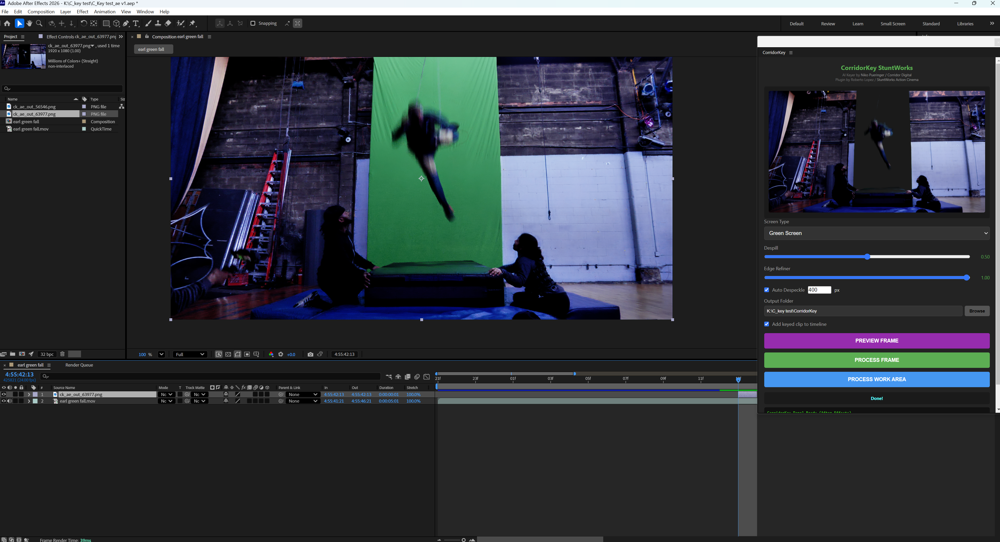
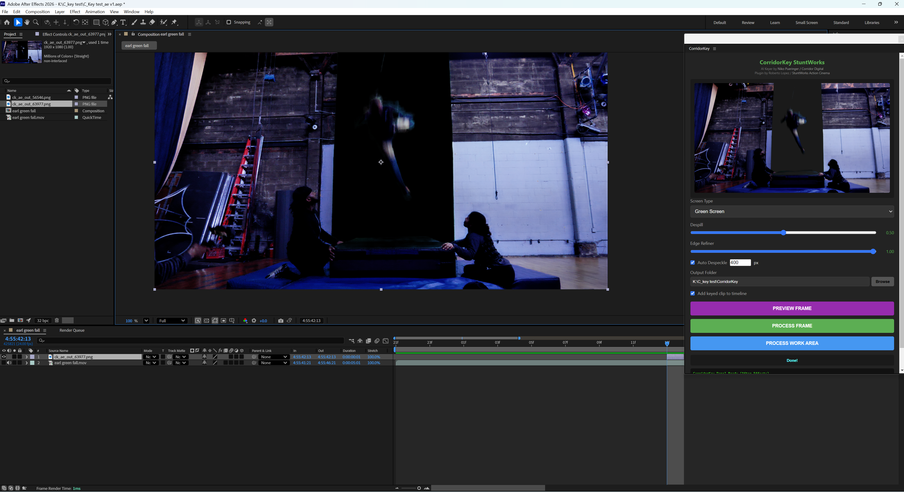
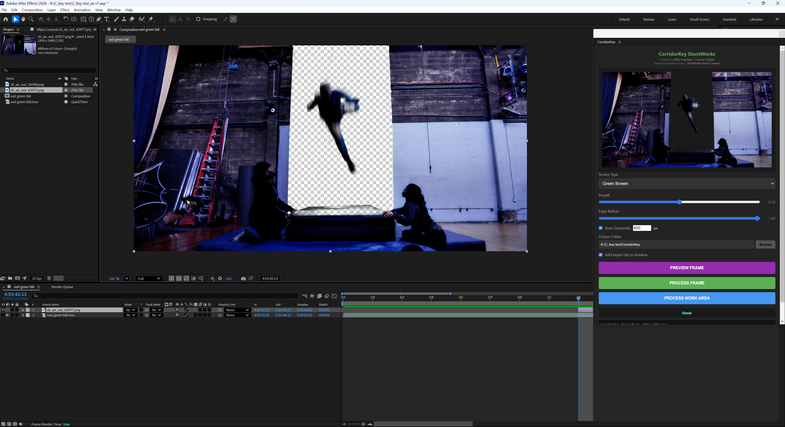
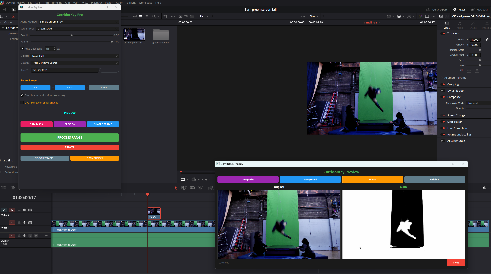

<div align="center">

# CorridorKey StuntWorks

### AI Green Screen Removal for Your Editor

[](https://www.blackmagicdesign.com/products/davinciresolve)
[](https://www.adobe.com/products/aftereffects.html)
[](https://www.adobe.com/products/premiere.html)

[](https://ko-fi.com/stuntworks)

[](LICENSE)
[](https://www.youtube.com/@stuntworkscinema)

---

**One-click neural keying powered by [CorridorKey](https://github.com/nikopueringer/CorridorKey)**
**by Niko Pueringer / Corridor Digital**

*Plugin by Roberto Lopez / [StuntWorks](https://www.youtube.com/@stuntworkscinema)*

</div>

---

## Why This Project Exists

StuntWorks Cinema is **Roberto Lopez and Elvis Lopez** — stunt performers and indie action filmmakers. We work primarily in **DaVinci Resolve** and **After Effects**, shooting real stunt and action shorts on tight budgets — imperfect green screen, bad lighting, motion blur, fast action — and existing keyers struggle with that footage. So we built this around the open-source CorridorKey AI engine for our own films.

**Free for all** — thanks to [Niko Pueringer](https://github.com/nikopueringer/CorridorKey) for releasing CorridorKey as open source.

**Active development — bigger upgrades coming. Tutorials on the way. Follow the channel for updates: [@stuntworkscinema](https://www.youtube.com/@stuntworkscinema).**

---

> **Which version should I download?**
> For a verified, tested build use the latest **[release tag](https://github.com/stuntworks/CorridorKey-StuntWorks/releases)** (currently `v1.0.0`). The `main` branch is active development and may include unfinished work.

---

## Test Footage

Real stunt/action greenscreen clips for testing are attached to the [v0.7.0 release](https://github.com/stuntworks/CorridorKey-StuntWorks/releases/tag/v0.7.0). **More clips coming with future releases.**

> **Important:** These are intentionally difficult shots — fast action, motion blur, and suboptimal lighting — chosen to stress-test the plugin on worst-case material. Results on well-lit production greenscreen will be significantly cleaner.

---

## Before / After

| Before | Keyed | Composite |
|:---:|:---:|:---:|
|  |  |  |

---

## Screenshots

| DaVinci Resolve | Premiere Pro |
|:---:|:---:|
|  |  |

---

## What It Does

> Drop green screen footage in your editor. Click one button. Get a clean key.

- AI-powered green / blue screen removal — no manual color picking
- Works inside **Resolve**, **After Effects**, and **Premiere Pro**
- Live preview viewer — see your key in a floating window, drag sliders to update in real time
- Batch process entire clips or frame ranges
- Adjustable despill, edge refinement, and despeckle
- Output saves to your project folder automatically

---

## Requirements

| Requirement | Details |
|---|---|
| **CorridorKey Engine** | [Install from GitHub](https://github.com/nikopueringer/CorridorKey) with Python venv |
| **GPU** | NVIDIA with CUDA, 8GB+ VRAM recommended |
| **Editor** | Resolve Studio 18+, After Effects 2020+, or Premiere Pro 2020+ |

### Output Codec — pick your bit depth

Resolve plugin v1.0 ships a codec dropdown next to the export-format selector:

| Codec | What it's for |
|---|---|
| **PNG 8-bit** (default) | Editor workflows. Universal compatibility, smallest files. Right for 99% of users. |
| **PNG 16-bit** | Lossless. Eliminates banding on subtle gradients. ~2× the file size of 8-bit. |
| **TIFF 16-bit** | Lossless universal — every VFX tool reads it. ~2× file size. |
| **EXR 32-bit** | VFX float standard. Used by Nuke / Houdini pipelines. Largest files, perfect precision. |

When you switch codec, both the keyed clip AND the SAM matte sidecar (when SAM 2 is active) save in that format. AE and Premiere v1.0 stay on PNG 8-bit; codec selection ships for AE/Premiere in v1.1.

### Hardware sizing — what to expect

| GPU VRAM | What works | What tends to fall over |
|---|---|---|
| **6 GB** | 1080p single frames, short ranges (<60 frames). Live preview OK. | 4K processing, long batch ranges, SAM 2 on 4K. Out-of-memory likely. |
| **8 GB** | 1080p batch processing, 1440p single frames, SAM 2 on 1080p. Recommended baseline. | 4K SAM 2 video propagation, very long ranges. |
| **12 GB+** | 1080p batch + SAM 2, 4K single frames, 4K live preview. | 4K SAM 2 video propagation on long ranges still tight. |
| **16 GB+** | 4K batch processing, 4K SAM 2 single-frame and short ranges. Comfortable headroom. | Sustained 4K SAM 2 over hundreds of frames may still need a closer eye on VRAM. |

> If you hit CUDA out-of-memory: drop to a lower-resolution proxy track, shorten the processing range, or skip SAM 2 (key with CK alone) on that clip. See [Troubleshooting](#troubleshooting).

---

## Install

```bash
git clone https://github.com/stuntworks/CorridorKey-StuntWorks.git
cd CorridorKey-StuntWorks
python install.py
```

| Flag | What it does |
|---|---|
| `--all` | Install to all detected apps |
| `--resolve` | Resolve only |
| `--adobe` | AE + Premiere only |
| `--uninstall` | Remove from all apps |

> Set `CORRIDORKEY_ROOT` environment variable if your CorridorKey install isn't in a sibling directory.

> ⭐ **If this saves you time, please star the repo** — it helps other action filmmakers find it.

---

<details>
<summary><h2>DaVinci Resolve</h2></summary>

**Open:** `Workspace > Scripts > CorridorKey`

### Setup
1. Preferences > System > General > External scripting: **Local**
2. Restart Resolve

### How to Use

| Step | Action |
|:---:|---|
| 1 | Put green screen footage on **Track 1** |
| 2 | Open the CorridorKey panel |
| 3 | Pick screen type, adjust despill and refiner |
| 4 | **SHOW PREVIEW** — opens a live preview window; drag sliders to update in real time |
| 5 | **PROCESS FRAME** — keys the current frame using your settings; places result on Track 2 |
| 6 | **PROCESS ALL** — keys the entire clip; sequence lands on Track 2 |

**Disable source clip** checkbox: when checked, Track 1 is hidden after processing so you see the keyed result immediately. Uncheck it if you want to keep the source visible for comparison.

Output saves to a `CorridorKey` folder next to your project.

### Refine Edges with AI Mask (SAM 2) — the headline feature

CorridorKey's neural keyer handles the chroma. **SAM 2** handles everything else — it's the difference between a 90% key and a clean 4K-ready edge. Click on the actor, the AI builds a silhouette, and your matte snaps to it.

| Step | Action |
|:---:|---|
| 1 | Open **SHOW PREVIEW** with a frame loaded |
| 2 | **Left-click** on the actor to add a positive dot (green) — the area you want to keep |
| 3 | **Right-click** on the background to add a negative dot (red) — the area to exclude |
| 4 | **APPLY MASK** — SAM 2 runs and refines the matte. The preview updates with the cleaner edge. |
| 5 | Add more dots and APPLY MASK again to refine further |
| 6 | **CLEAR** — removes all dots and resets the AI mask |

**Multi-object** for tricky shots — actor + separate prop, body + feet on a floor that the chroma can't kill. Press **Tab** to switch between **MASK 1** (cyan, body / on-green) and **MASK 2** (magenta, feet / off-green). Each mask gets its own dots and APPLY MASK action.

> **PROCESS ALL with SAM 2:** when you batch a range, SAM 2 propagates your anchor-frame dots through the whole sequence so the cleanup tracks with the actor. No re-clicking per frame.

</details>

---

<details>
<summary><h2>After Effects</h2></summary>

**Open:** `Window > Extensions > CorridorKey`

### How to Use

| Step | Action |
|:---:|---|
| 1 | Select the green screen **layer** in your comp |
| 2 | Pick screen type, adjust despill and refiner |
| 3 | **PREVIEW FRAME (LIVE)** — opens a floating preview window; drag sliders to update in real time |
| 4 | **KEY CURRENT FRAME** — keys the frame using your settings; imports above your layer |
| 5 | **PROCESS WORK AREA** — key all frames in work area (B/N to set range) |

Output saves to a `CorridorKey` folder next to your project.

> **Note:** Batch processing runs in one shot — AE will freeze while processing, then come back with all frames ready.

### Refine Edges with AI Mask (SAM 2) — the headline feature

CorridorKey's neural keyer handles the chroma. **SAM 2** handles everything else — it's the difference between a 90% key and a clean 4K-ready edge. Click on the actor in the preview window, the AI builds a silhouette, your matte snaps to it.

| Step | Action |
|:---:|---|
| 1 | **PREVIEW FRAME (LIVE)** to open the floating preview |
| 2 | **Left-click** on the actor to add a positive dot (green) — the area you want to keep |
| 3 | **Right-click** on the background to add a negative dot (red) — the area to exclude |
| 4 | **APPLY MASK** — SAM 2 runs and refines the matte. The preview updates with the cleaner edge. |
| 5 | Add more dots and APPLY MASK again to refine further |
| 6 | **CLEAR** — removes all dots and resets the AI mask |

**Multi-object** for tricky shots — press **Tab** to switch between **MASK 1** and **MASK 2**. Each mask gets its own dots and APPLY MASK action.

> **AE v1.0 limitation:** the SAM 2 click flow currently runs in the **live preview window only** (it cleans the matte while you're scrubbing). The PROCESS WORK AREA batch render in v1.0 outputs the CK matte alone — SAM 2 video propagation through the range is shipping in **v1.1**. Until then, use the Resolve plugin for the full two-mask batch flow, or use the AE preview to verify your dots before keying.

</details>

---

<details>
<summary><h2>Premiere Pro</h2></summary>

**Open:** `Window > Extensions > CorridorKey`

### How to Use

| Step | Action |
|:---:|---|
| 1 | Put green screen footage on **V1** |
| 2 | Move playhead to the frame you want |
| 3 | Pick screen type, adjust despill and refiner |
| 4 | **PREVIEW FRAME (LIVE)** — opens a floating preview window; drag sliders to update in real time |
| 5 | **KEY CURRENT FRAME** — keys the frame using your settings; places on V2 |
| 6 | **PROCESS IN/OUT RANGE** — set I/O points, batch key all frames |

Output saves to a `CorridorKey` folder next to your project.

### Options

| Option | What it does |
|---|---|
| **Add keyed clip to timeline** | Uncheck for complex timelines — files go to bin only |
| **Output Folder** | Defaults to project folder. Click Browse to change. |

> **Note:** Keyed files appear in a "CorridorKey" bin in your project panel. You need V1 + V2 tracks for auto-placement.

### Refine Edges with AI Mask (SAM 2) — the headline feature

CorridorKey's neural keyer handles the chroma. **SAM 2** handles everything else — it's the difference between a 90% key and a clean 4K-ready edge. Click on the actor in the preview window, the AI builds a silhouette, your matte snaps to it.

| Step | Action |
|:---:|---|
| 1 | **PREVIEW FRAME (LIVE)** to open the floating preview |
| 2 | **Left-click** on the actor to add a positive dot (green) — the area you want to keep |
| 3 | **Right-click** on the background to add a negative dot (red) — the area to exclude |
| 4 | **APPLY MASK** — SAM 2 runs and refines the matte. The preview updates with the cleaner edge. |
| 5 | Add more dots and APPLY MASK again to refine further |
| 6 | **CLEAR** — removes all dots and resets the AI mask |

**Multi-object** for tricky shots — press **Tab** to switch between **MASK 1** and **MASK 2**. Each mask gets its own dots and APPLY MASK action.

> **Premiere v1.0 limitation:** SAM 2 runs in the live preview window only. The PROCESS IN/OUT RANGE batch render in v1.0 outputs the CK matte alone — SAM 2 video propagation through the range is shipping in **v1.1**. Until then, use Resolve for the full two-mask batch flow.

</details>

---

## Troubleshooting

### CUDA out of memory

Symptom: a `CUDA out of memory` error in the panel status, or the engine crashes mid-batch.

Causes and fixes:
- **Frame size too large for your VRAM.** Drop to a 1080p proxy track for the keying pass and reconnect to the 4K master in your editor. See [Hardware sizing](#hardware-sizing--what-to-expect).
- **SAM 2 on 4K with limited VRAM.** Skip SAM 2 on that clip — key with CorridorKey alone (no APPLY MASK), or do SAM 2 only on a 1080p proxy.
- **Other GPU apps running.** Close Chrome / OBS / other CUDA apps. DaVinci itself uses 2–4 GB on a working timeline before CorridorKey loads.
- **Stuck VRAM after a crash.** Restart the editor (DaVinci or AE). The OS reclaims the leaked VRAM on process exit.

### "Engine not found" / `CORRIDORKEY_ROOT` env var

Symptom: panel shows *"CorridorKey engine not found"* or the install script fails to locate the engine repo.

Fix: set the `CORRIDORKEY_ROOT` environment variable to the path where you cloned [CorridorKey](https://github.com/nikopueringer/CorridorKey).

**Windows (PowerShell, persistent):**
```powershell
[Environment]::SetEnvironmentVariable("CORRIDORKEY_ROOT", "C:\path\to\CorridorKey", "User")
```

**macOS / Linux (bash/zsh, add to `~/.bashrc` or `~/.zshrc`):**
```bash
export CORRIDORKEY_ROOT="/path/to/CorridorKey"
```

Restart your editor (and the terminal) after setting it. The installer also probes a sibling directory next to this plugin's folder — if you cloned both repos side by side, you usually don't need the env var.

### SAM 2 weights missing

Symptom: APPLY MASK errors with a missing `sam2.1_hiera_small.pt` file, or the engine fails to load on first SAM 2 use.

Fix: SAM 2 weights live at `<CorridorKey engine>/sam2_weights/sam2.1_hiera_small.pt`. The setup script downloads them automatically — re-run `setup.bat` (Windows) or `./setup.sh` (macOS / Linux) in the engine folder. If automatic download fails (firewall, gated host), grab the file manually from the [SAM 2 release page](https://github.com/facebookresearch/sam2) and drop it into `sam2_weights/`.

### DaVinci Resolve — script doesn't appear under `Workspace > Scripts`

Resolve only runs external scripts when scripting is set to **Local**:

1. **Preferences → System → General → External scripting using:** set to **Local**
2. **Restart Resolve** (the menu doesn't pick up new scripts on Reload Apps).

If `CorridorKey` still doesn't appear, confirm `CorridorKey.py` exists at:
- Windows: `%PROGRAMDATA%\Blackmagic Design\DaVinci Resolve\Fusion\Scripts\Utility\CorridorKey.py`
- macOS: `/Library/Application Support/Blackmagic Design/DaVinci Resolve/Fusion/Scripts/Utility/CorridorKey.py`

Re-run `python install.py --resolve` if the file is missing.

### After Effects / Premiere Pro — panel doesn't load or shows blank

Adobe blocks unsigned CEP extensions by default. The installer enables debug mode on first install, but if the panel still doesn't appear, set the debug flag manually:

**Windows (Registry Editor):**
```
HKEY_CURRENT_USER\Software\Adobe\CSXS.11
   PlayerDebugMode = "1"  (String value)
HKEY_CURRENT_USER\Software\Adobe\CSXS.10
   PlayerDebugMode = "1"  (String value)
HKEY_CURRENT_USER\Software\Adobe\CSXS.9
   PlayerDebugMode = "1"  (String value)
```

**macOS (Terminal):**
```bash
defaults write com.adobe.CSXS.11 PlayerDebugMode 1
defaults write com.adobe.CSXS.10 PlayerDebugMode 1
defaults write com.adobe.CSXS.9 PlayerDebugMode 1
```

Restart AE / Premiere after setting the flag. Note: `CSXS.X` matches your AE / Premiere version family — set the flag for whichever version you're using (CSXS.9 for CC 2019, CSXS.10 for CC 2020, CSXS.11 for CC 2021+).

If the panel loads blank, open the editor's CEP debug log:
- Windows: `%APPDATA%\Adobe\CEP\logs\CEPHtmlEngine*.log`
- macOS: `~/Library/Logs/CSXS/CEPHtmlEngine*.log`

Most blank-panel errors trace back to a missing engine path — fix `CORRIDORKEY_ROOT` first (see above).

---

## For Developers

Editing this plugin? Read these first, in order:

1. **[ALIGNMENT.md](./ALIGNMENT.md)** — canonical reference for Premiere Pro frame
   alignment. Before touching `ppro_getFrameInfo`, `ppro_importFrame`, or any
   batch frame math, read this. Same alignment was broken and re-fixed four
   times in three days; the doc exists so it stops happening. Includes a
   mandatory pre-commit smoke test.
2. **[CLAUDE.md](./CLAUDE.md)** — entry point for AI coding assistants working
   on this repo.
3. **[INSTALL.md](./INSTALL.md)** — full install walkthrough for end users.
4. **[CODE_REVIEW_2026-04-14.md](./CODE_REVIEW_2026-04-14.md)** — latest
   security + quality audit (all Critical and High items are addressed).

Rebuild the engine venv: `setup.bat` (Windows) or `./setup.sh` (macOS / Linux).

---

<div align="center">

## Support

If this saves you time, consider buying me a coffee: https://ko-fi.com/stuntworks

[](https://ko-fi.com/stuntworks)

**Bug? Feature request? Open an issue:**
https://github.com/stuntworks/CorridorKey-StuntWorks/issues

---

### Credits

**CorridorKey AI Engine** — [Niko Pueringer / Corridor Digital](https://github.com/nikopueringer/CorridorKey)

**Plugin** — Roberto Lopez / [StuntWorks](https://www.youtube.com/@stuntworkscinema)

---

*Free and open source under [CC-BY-NC-SA-4.0](LICENSE)*

</div>
